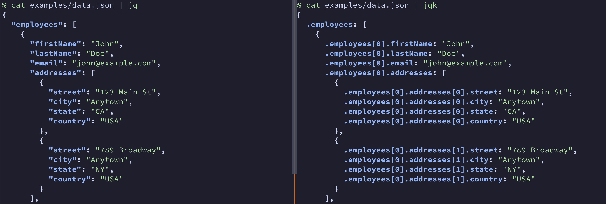

# jqk

*jqk* lists key patterns of a JSON file for [jq](https://github.com/jqlang/jq).



## Why?

jq is a useful command line tool to filter values from a JSON file quickly on a
terminal; however, knowing the right pattern to extract the target value is not
easy to do especially when a JSON file has so many nests and arrays. jqk helps
to render all keys with the jq patterns so that you can look through a JSON
file using pagers like `less` to find the pattern you need to pass to jq.

## Installation

1. Download a pre-built binary from
[the latest release](https://github.com/wkentaro/jqk/releases).

2. Or install via `cargo`:

```bash
cargo install jqk
```

## Examples

NOTE: `cat xxx.json | jqk` is equivalent to `jqk xxx.json`.

```
$ cat examples/data.json | jqk
{
  .departments: [
    {
      .departments[0].employees: [
        "John Doe",
        "Jane Doe"
      ],
      .departments[0].head: "John Doe",
      .departments[0].name: "Engineering",
      .departments[0].projects: [
        {
          .departments[0].projects[0].budget: 50000,
          .departments[0].projects[0].deadline: "2023-12-31",
          .departments[0].projects[0].name: "Project A"
        },
...

$ cat examples/data.json | jqk -l
.departments
.departments[0].employees
.departments[0].head
.departments[0].name
.departments[0].projects
.departments[0].projects[0].budget
.departments[0].projects[0].deadline
.departments[0].projects[0].name
...

$ cat examples/data.json | jq .departments[].projects[].name
"Project A"
"Project B"
"Campaign X"
```


## Related projects

- `jq`: https://github.com/jqlang/jq
- `jqk-python`: https://github.com/wkentaro/jqk-python
